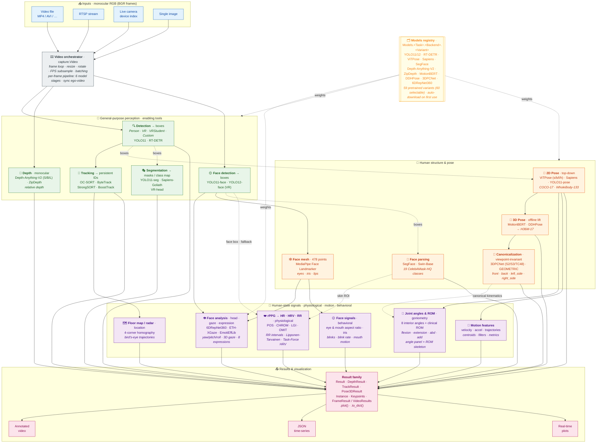

<div align="center">

# Physiotrack

**Contactless human understanding: turning pixels into interpretable physiological and behavioral signals.**

[](https://www.gnu.org/licenses/gpl-3.0)
[](https://www.python.org/downloads/)
[](https://pytorch.org/)

[](https://tharindu326.github.io/physiotrack/)

📖 **[Full documentation & API reference](https://tharindu326.github.io/physiotrack/)**

[Why Physiotrack](#why-physiotrack) ·
[Architecture](#architecture) ·
[Install](#installation) ·
[Quick start](#quick-start) ·
[Subsystems](#subsystem-guide) ·
[Models](#model-registry) ·
[Limitations](#scope--limitations) ·
[Citations](#citations)

</div>

---

**Physiotrack** is an open-source Python toolkit for contactless human understanding. It integrates
state-of-the-art computer-vision models (YOLO11, RT-DETR, ViTPose, Sapiens, Depth-Anything-V2,
ZipDepth, MotionBERT, 6DRepNet360, SegFace, MediaPipe Face Mesh, ETH-XGaze) into a **single, unified API** that extracts actionable, theory-linked
signals from ordinary **RGB video**, for healthcare, education, XR, and operator-support
systems. Developed at the **Center for Machine Vision and Signal Processing (CMVS), University of Oulu**.

<div align="center">

[](https://youtu.be/DFVYfZCk3t4)

▶️ **[Watch the demo on YouTube](https://youtu.be/DFVYfZCk3t4)**

</div>

### Example outputs

<div align="center">


<sub>Full pipeline on one frame of a person in VR walking in a lab: tracked whole-body pose with a persistent id, live joint-angle &amp; clinical-ROM panels, the ROM skeleton, the wrist-motion plot, and colorized <i>relative</i> monocular depth. Respiration here comes from shoulder motion, reusing the pose keypoints.</sub>

<br/><br/>


<sub>Contactless rPPG on an RGB face recording: one SegFace pass yields the face parsing and skin ROI that drive the live blood-volume-pulse signal and the derived heart rate (78.0 bpm at &minus;0.1 dB SNR here). Regenerate with <code>examples/evaluation/rppg_figure.py</code>.</sub>

</div>

## Why Physiotrack?

Foundational models are good at labeling *what* they see. Physiotrack is designed to help systems
understand *what it means*. It converts an ordinary RGB video stream into interpretable
human-state features: pose and motion patterns, posture symmetry, head orientation and gaze
stability, and rPPG-derived heart rate, heart-rate variability (HRV) and respiration rate.

The philosophy is simple: **"send meaning, not pixels"**, so downstream AI agents can reason about
human *states* instead of processing raw video.

---

## Table of Contents

- [Architecture](#architecture)
- [Key Features](#key-features)
- [Installation](#installation)
- [Quick Start](#quick-start)
- [The Unified API](#the-unified-api)
- [Subsystem Guide](#subsystem-guide)
- [Model Registry](#model-registry)
- [Result Objects](#result-objects)
- [Scope & Limitations](#scope--limitations)
- [Project Layout](#project-layout)
- [Citations](#citations)
- [Contributing](#contributing)
- [License](#license)
- [Authors & Acknowledgments](#authors)

---

## Architecture

Physiotrack is organized into **independent, composable subsystems**. Each one works standalone
through the same `predict()` API, and the `Video` orchestrator wires them into an end-to-end
pipeline. Every neural backend is resolved on demand through the **`Models` registry**, which
auto-downloads weights from Hugging Face.

The modules group into three tiers that mirror the *"send meaning, not pixels"* pipeline:
**🧰 enabling tools** (generic CV) → **🧍 human structure** (pose & kinematics) → **📡 human-state
signals** (the interpretable payload).



**Reading the diagram:** read it as *pixels → tools → human structure → signals*.
**🧰 Enabling tools** (detection, tracking, segmentation, depth, face detection) localize and parse the
image; **🧍 human structure** (2D/3D pose, canonicalization, face parsing, face mesh) turns those
into body-specific estimates; **📡 human-state signals** (rPPG HR/RR, **joint angles & clinical ROM**,
motion, head orientation, gaze, expression, blinks, location) are the interpretable payload. Each box lists its backend
options/variants (italics = key options or output format), selected through the
[`Models` registry](#model-registry). Solid arrows are per-frame data flow; dotted arrows show
detection boxes feeding pose/segmentation, skin regions feeding rPPG, canonical pose feeding the
angles, and weights from the registry. Every module also works standalone. Inputs are **monocular
RGB** (BGR frames) via OpenCV. Depth is *estimated* monocularly rather than sensed: there is no
RGB-D, infrared or thermal capture path. Where a clip comes from an RGB-D camera, only its colour
stream is used.

---

## Key Features

| Subsystem | What it does | Backends |
|-----------|--------------|----------|
| **Detection** | Multi-person / object boxes with confidences | YOLO11, RT-DETR, VR-specific |
| **Tracking** | Persistent IDs across frames, occlusion-robust | OC-SORT, ByteTrack, StrongSORT, BoostTrack |
| **Pose 2D** | Body keypoints (17 COCO or 133 whole-body) | ViTPose, Sapiens, YOLO11-Pose |
| **Pose 3D** | Lift 2D keypoints to 3D over time | MotionBERT, DDHPose |
| **Canonicalization** | Viewpoint-invariant 3D pose alignment | 3DPCNet, geometric |
| **Segmentation** | Pixel-level instance masks | YOLO-Seg, Sapiens, VR-Head |
| **Face parsing** | Face-part segmentation (19 classes) | SegFace (Swin-Base) |
| **Depth** | Monocular dense depth estimation | Depth-Anything-V2 (s/b/l), ZipDepth (base/npu) |
| **Face** | Face detection, then per-face stages: head orientation, 478-point face mesh, expression (+ valence/arousal), 3D gaze, image quality, visible face parts | YOLO-Face, 6DRepNet360, CMVS-FO-VR, MediaPipe Face Landmarker, EmotiEffLib, ETH-XGaze / MPIIFaceGaze / MPIIGaze, SegFace |
| **Face signals** | Eye / mouth aspect ratio and iris position per frame; blinks, blink rate, mouth movement and windowed statistics per tracked face | Soukupová & Čech EAR, validated on MPEBlink and FELT / RAVDESS |
| **Signals** | rPPG heart rate, HRV, respiration + motion features | POS, CHROM, LGI, OMIT; RR intervals; Lipponen-Tarvainen artefact correction; Task-Force HRV |
| **Joint angles & ROM** | 8 anatomical joint angles + clinical range-of-motion (flexion/extension/abduction/adduction) as rows in the left-side angle panel, plus a clean full-room **skeleton canvas** | goniometry from pose |
| **Views** | Bird's-eye floor map, ego-video, depth & angle/ROM overlays | n/a |

**Inputs:** monocular RGB video — files, RTSP streams, live cameras, or single images. **Hardware:** CPU or CUDA GPU (acceleration
recommended for real-time use).

---

## Installation

**Requires Python 3.10 or newer.** Install the PyTorch build that matches your platform
first, then the package. The command below is CPU-only; for CUDA, ROCm, or Apple
Silicon use the official [PyTorch selector](https://pytorch.org/get-started/locally/).

```bash
git clone https://github.com/tharindu326/physiotrack.git
cd physiotrack

python -m pip install torch torchvision --index-url https://download.pytorch.org/whl/cpu

python -m pip install -e .
```

Everything else resolves from `pyproject.toml`. Optional extras:

```bash
python -m pip install -e ".[test]"     # test suite + NeuroKit2 reference checks
python -m pip install -e ".[docs]"     # MkDocs toolchain
python -m pip install -e ".[pose3d]"   # smplx, for Pose3D mesh rendering
```

| | Supported |
| --- | --- |
| Python | 3.10, 3.11, 3.12 |
| OS | Linux, macOS, Windows |
| Hardware | CPU, or CUDA GPU (recommended for real-time use) |

Model weights are **not** bundled; they download automatically on first use through the
[`Models` registry](#model-registry) (Ultralytics weights via `ultralytics`, everything else from
Hugging Face).

#### Where weights are cached

Checkpoints are cached **outside** the installed package, so a read-only or containerised
install works, Docker layer caching is not defeated by a multi-gigabyte write into
`site-packages`, and several environments can share one download:

| | Location |
| --- | --- |
| `$PHYSIOTRACK_HOME` set | `$PHYSIOTRACK_HOME/weights` |
| `$XDG_CACHE_HOME` set | `$XDG_CACHE_HOME/physiotrack/weights` |
| Linux (default) | `~/.cache/physiotrack/weights` |
| macOS | `~/Library/Caches/physiotrack/weights` |
| Windows | `%LOCALAPPDATA%\physiotrack\weights` |

```bash
export PHYSIOTRACK_HOME=/shared/physiotrack   # share one cache across envs or containers
```

> **Upgrading from before 1.1?** Older versions downloaded into the package directory. Run
> `python -c "import physiotrack; physiotrack.migrate_weight_cache()"` once to move existing
> checkpoints into the cache instead of re-downloading them. Add `dry_run=True` to preview.

> **Conda development:** `conda env create -f environment-dev.yml`, activate
> `physiotrack-dev`, install the appropriate PyTorch build, then run
> `python -m pip install -e ".[test,docs]"`. PyTorch stays a separate step because
> CPU/CUDA/ROCm selection is machine-specific.

> **Video codecs:** The `Video` pipeline tries H.264 first and falls back to MPEG-4 with a
> warning. If neither encoder is available, install an OpenCV build with the codecs your
> platform requires. See the [complete installation guide](https://tharindu326.github.io/physiotrack/getting-started/installation/).

### Testing

```bash
pip install -e ".[test]"
pytest
```

The suite validates the biomedical DSP against closed-form definitions and synthetic signals
with known ground truth, and cross-checks the HRV, artefact-correction and pulse-peak paths
against NeuroKit2 as an independent reference implementation. It must pass with **zero
skips**: `neurokit2` is part of the `test` extra precisely so those cross-checks cannot skip
silently and leave the strongest correctness claim unverified.

---

## Quick Start

```python
import cv2
import physiotrack as pt

frame = cv2.imread("examples/face_detection/data/selfie/two_person_selfie.jpg")

# Detect people
det    = pt.Detection.Person(conf=0.25, device=0)
result = det.predict(frame)          # -> Result
cv2.imwrite("out.png", result.plot())

# Whole-body 2D pose (auto-detects people if no boxes given)
pose   = pt.Pose.Person()
people = pose.predict(frame)
wrist  = people[0].keypoints.by_name("left_wrist")
print(wrist.x, wrist.y, wrist.confidence)
```

Runnable face examples with bundled synthetic media:

```bash
python examples/face_detection/detect_faces.py
python examples/face_detection/compare_cpu_gpu.py  # requires CUDA
python examples/face_tracking/track_faces.py
python examples/face_analysis/analyze_image.py    # needs pip install "physiotrack[face]"
python examples/face_analysis/analyze_video.py
python examples/vr_detection/detect_vr_people.py
```

They save annotated images/video plus CSV and JSON records. The
[face examples guide](https://tharindu326.github.io/physiotrack/guides/face-examples/)
explains the face outputs, while the
[detection guide](https://tharindu326.github.io/physiotrack/guides/detection/)
distinguishes VR-head, VR-person, and generic-person boxes.

---

## The Unified API

Everything user-facing is reached through one flat, predictable hierarchy. Import the entry
points from the top-level `physiotrack` package (or a named subsystem); you never need to reach
into internal module paths:

```text
physiotrack ─┬─ Detection.Person() / .VR() / .VRStudent() / .Custom()
             ├─ Pose.Person() / .VRStudent() / .Custom()
             ├─ Pose3D(...) · canonicalize_pose(...) · PoseCanonicalizer
             ├─ Segmentation.Person() / .VRHead() / .BodyPart() / .Face() / .Custom()
             ├─ Depth.DepthAnythingV2Small() / Base() / Large() / .ZipDepth() / .ZipDepthNPU() / .Custom()
             ├─ Face · VRFace                           # face detectors
             ├─ FaceOrientation · FaceLandmarks · FaceExpression · GazeEstimator ·
             │  FaceQuality · FaceRegions
             │                                          # face stages: stage(frame, faces)
             ├─ Tracker(config=TrackerConfig(...))
             ├─ Video(...)                              # end-to-end pipeline orchestrator
             ├─ Models.<Task>.<Backend>.<Variant>       # model registry (auto-download)
             └─ Result · DepthResult · TrackResult      # returned by every predictor
                          ↳ .boxes · .keypoints · .seg_map · .names · .plot() · .to_dict()

physiotrack.signals ─┬─ compute (plotter-free, use directly):
                     │    joint_angles() · compute_rom_angles() · motion features · respiration_from_motion()
                     │    rPPG: POS/CHROM/LGI/OMIT · HeartRateEstimator · bvp_to_hr · bvp_snr
                     │    pulse analysis: bvp_to_rri · correct_rr_artifacts · compute_hrv · respiration_from_pulse/rri
                     │    face: eye_aspect_ratio · mouth_aspect_ratio · iris_position ·
                     │          detect_blinks · blink_rate · mouth_movement ·
                     │          face_feature_sequence · face_window_summary
                     │    filters · agreement metrics (Pearson, RMSE, DTW, hrv_errors, …)
                     └─ overlays (optional, wrap the compute above):
                          JointAnglePlotter · RPPGPlotter · HeartRatePlotter · HRVPlotter · RespirationPlotter · KeypointMotionPlotter · RealTimePlotter
physiotrack.pose    ── keypoint name maps (COCO_WHOLEBODY_NAMES, HUMAN26M_NAMES)
physiotrack.face    ── drawing helpers (draw_axis, plot_pose_cube)
```

Every image predictor (`Detection`, `Pose`, `Segmentation`, `Depth`, `Face`) follows the
**same pattern** (modeled on Ultralytics / MediaPipe / scikit-learn):

```python
model  = pt.Detection.Person(conf=0.25, iou=0.45, device=0)   # 1. configure the MODEL
result = model.predict(image)                                 # 2. predict  (or: model(image))
data   = result.boxes                                         # 3. read structured data
frame  = result.plot()                                        # 4. draw the overlay
```

Three rules make the whole library predictable:

1. **One verb.** Every predictor exposes `.predict(img)` and is callable. Batch with a list:
   `predict([img, img, ...]) -> list[Result]`.
2. **One return type.** Every predictor returns a rich [`Result`](#result-objects) object, not
   tuples in mixed orders.
3. **Rendering lives on the result, not the model.** `result.plot(...)` draws the overlay;
   constructors only configure the model.

---

## Subsystem Guide

<details open>
<summary><b>Detection</b></summary>

```python
from physiotrack import Detection, Models

det = Detection.Person()                       # also .VR() .VRStudent()
result = det.predict(image)
print(result.boxes)                            # (N, 4)
for inst in result:
    print(inst.box, inst.confidence, inst.cls_name)

det = Detection.Custom(model=Models.Detection.YOLO.VR.m_vr)   # custom weights
```
</details>

<details>
<summary><b>Pose estimation (2D)</b></summary>

```python
from physiotrack import Pose, Models

pose = Pose.Person()                           # or Pose.VRStudent(), Pose.Custom(model=...)
result = pose.predict(image)                   # auto-detects people if no boxes given
print(result.architecture)                     # "WHOLEBODY" or "COCO"

for person in result:
    wrist = person.keypoints.by_name("left_wrist")
    if wrist:
        print(wrist.x, wrist.y, wrist.confidence)

pose = Pose.Custom(model=Models.Pose.ViTPose.WholeBody.l_wholebody)
```

- **COCO**: 17 keypoints (body only). **WholeBody**: 133 keypoints (body + hands + face).
- When no bounding boxes are supplied, the pose estimator detects people with the default detector.
</details>

<details>
<summary><b>Pose 3D &amp; canonicalization</b></summary>

```python
from physiotrack import Models, Pose, Pose3D, Video, canonicalize_pose

results = Video(source="clip.mp4", pose=Pose.Person()).run()   # 2D pass

p3d = Pose3D(model=Models.Pose3D.MotionBERT.mb_ft_h36m_global_lite, device="cpu")
poses = p3d.predict(results, fps=30)        # -> Pose3DResult, (N, 17, 3) H3.6M order
poses.by_name("left_wrist")                 # (N, 3) trajectory of one joint

# Viewpoint-invariant canonical form
canonical = canonicalize_pose(poses.poses, view="front")        # geometric (training-free) default
canonical = canonicalize_pose(                                 # learned 3DPCNet (recommended)
    poses.poses,
    model=Models.Pose3D.Canonicalizer.Models._3DPCNetTC48_byCam,
    view="front",
)

# Or canonicalize during lifting, and use predict_json() for the file-based workflow.
```

> Lifting is **sequence-level** (a temporal model needs a window of 2D frames per 3D frame)
> and single-subject. Coordinates are root-relative, not metric.
</details>

<details>
<summary><b>Segmentation, Depth, Face</b></summary>

```python
import physiotrack as pt
from physiotrack import Segmentation, Depth, VRFace, FaceOrientation, Models

seg = Segmentation.Person()
seg_map = seg.predict(image).seg_map           # (H, W) class map

# Face parsing (SegFace, 19 face-part classes). Faces are auto-detected if no
# boxes are given; pass boxes=[...] to parse specific faces.
parse = Segmentation.Face()
result = parse.predict(image)                  # -> Result(task="segment")
seg_map = result.seg_map                       # (H, W) face-part class map
annotated = result.plot()                      # overlay with the 19-class palette

depth = Depth.DepthAnythingV2Base()            # or Depth.ZipDepth() — lightweight, 6.8M params
d = depth.predict(image)
raw, colored = d.depth, d.plot(colormap="inferno")

faces = VRFace()(image)                        # face boxes, Result(task="face")
faces = FaceOrientation(model=Models.Face.Orientation.VR)(image, faces)
for face in faces:
    print(face.orientation)                    # {"yaw": .., "pitch": .., "roll": ..}

# More face stages (pip install "physiotrack[face]"); each adds one field per face.
faces = pt.FaceLandmarks()(image, faces)       # .keypoints: 478-point face mesh
faces = pt.FaceExpression()(image, faces)      # .expression: label, confidence, scores
faces = pt.GazeEstimator()(image, faces)       # .gaze: 3D direction, yaw, pitch
pt.signals.eye_aspect_ratio(faces[0])          # {'left': .., 'right': .., 'mean': ..}
```
</details>

<details>
<summary><b>Signals: rPPG / heart rate / HRV / respiration &amp; motion</b></summary>

The computation is **plotter-free** — use it directly; the overlay is an optional wrapper.

```python
from physiotrack.signals import POS, bvp_to_hr, bandpass_filter
from physiotrack.signals import FaceSkinExtractor, HeartRateEstimator

# Low level: one rPPG method on an RGB skin trace, shape (3, N) with rows R, G, B
bvp   = POS(fps=30).apply(rgb_trace)            # blood-volume-pulse candidate
clean = bandpass_filter(bvp, 0.75, 4.0, 30)
hr_bpm, times = bvp_to_hr(clean, fps=30)        # per-window HR (bpm) + window-centre times
latest = hr_bpm[-1]                             # a series, not a single number

# High level: SegFace face parsing -> rPPG on the skin (no plotter)
fs  = FaceSkinExtractor()                        # SegFace (detects faces itself)
est = HeartRateEstimator("POS", fps=30, window_sec=60)   # POS/CHROM/LGI/OMIT; bands configurable
mask, skin_canvas = fs.extract(frame)            # skin ROI mask + image-res skin canvas
est.update(frame, roi_mask=mask)                 # rPPG on the segmented skin; call per frame
print(est.hr, est.snr)                           # HR (bpm), de Haan SNR (dB)

# The same window also yields the downstream pulse analytics (no re-computation):
print(est.hrv())                                 # {RMSSD, SDNN, pNN50, SD1, SD2, LF/HF, ...}
print(est.respiration_rate())                    # breaths/min (RIAV; use "rsa" for RSA)

# Or step through the pulse-analysis chain explicitly:
from physiotrack.signals import bvp_to_rri, correct_rr_artifacts, compute_hrv
rri_ms, _   = bvp_to_rri(clean, fps=30)          # RR / inter-beat intervals (ms)
rri_ms, _   = correct_rr_artifacts(rri_ms)       # Lipponen-Tarvainen (2019) beat correction
hrv         = compute_hrv(rri_ms)                # time + frequency + non-linear HRV
# Note: correction re-derives the series from the corrected beats, so its length can
# change. Let compute_hrv rebuild the timestamps rather than reusing the originals.
```
(`update` also accepts a face `box` as a lightweight fallback when you don't run segmentation.)

For on-frame overlays, wrap a (shared) estimator with `RPPGPlotter` (BVP pulse), `HeartRatePlotter`
(bpm), `HRVPlotter` (HRV grid) and `RespirationPlotter` (breaths/min) — all read one
`HeartRateEstimator`, so the rPPG is computed once. See
[`examples/rppg_vitals.py`](examples/rppg_vitals.py) (all panels together); or enable them in the
pipeline with `Video(..., rppg=True, hrv=True, respiration=True)`. Respiration also has a pose-based route
(`respiration_from_motion`) that cross-validates the rPPG estimate. All HRV / artefact-correction
formulas are validated against closed-form definitions, and the HRV, artefact-correction and
pulse-peak paths are additionally cross-checked against NeuroKit2 as a reference implementation. Also includes motion features,
filters/normalizers, and signal-agreement metrics (`compute_rmse`,
`calculate_pearson_correlation`, `calculate_dtw_distance`, `hrv_errors`, …).
</details>

<details>
<summary><b>Joint angles &amp; clinical ROM (goniometry)</b></summary>

Two kinds of angle, both derived from pose keypoints:

- **Interior joint angles** — 8 anatomical angles (left/right **shoulder, elbow, hip, knee**), the
  angle *at* each joint. Good for any activity (e.g., gait-cycle joint-angle trajectories).
- **Clinical range-of-motion (ROM)** — named physiotherapy movements (**hip flexion / extension /
  abduction / adduction**), measured against a body reference axis. In the pipeline the values appear
  in the ROM grid, and the movements are drawn as **colour-coded goniometric arcs** on a clean
  **white-background skeleton panel** that mirrors the full room (so the person's position is
  preserved and the main frame stays uncluttered). Both sit on the left, under the joint-angle grid.
  Best for a controlled assessment (patient lying or standing).

The measurement is **plotter-free** — run it straight on pose keypoints:

```python
import physiotrack as pt
from physiotrack.signals import joint_angles, compute_rom_angles, JointAnglePlotter

det = pt.Pose.Person().predict(frame).to_dict()["instances"]
kps = det[0]["keypoints"]   # list of {"id", "x", "y", "confidence"} for one person
joint_angles(kps)        # {'leftElbow': 152, 'leftKnee': 174, ...}   interior angles
compute_rom_angles(kps)  # {'leftHipFlexion': 12, 'leftHipAbduction': 34, ...}  clinical ROM

# Optional overlay (wraps the same functions): joint-angle grid + ROM grid (2-col L|R)
plotter = JointAnglePlotter(rom=True)
plotter.update(result.to_dict()["instances"], frame_time=t)
frame = plotter.attach_to_frame(frame, position="top_left")
```

In the `Video` pipeline (see below): `plot_angles=True` shows the interior joint-angle grid;
`rom=True` (or a list like `["leftHipFlexion", "rightHipFlexion"]`) adds the clinical ROM grid and a
full-room **skeleton canvas** with color-matched arcs; `rom_render=False` keeps the ROM values in the
grid but hides the skeleton canvas. The angle/ROM grids and skeleton stack together on the left.
</details>

<details>
<summary><b>Tracking &amp; full video pipeline</b></summary>

```python
from physiotrack import Tracker, TrackerConfig, Video, Pose, Detection, Models

tracker = Tracker(config=TrackerConfig(tracker="ocsort", classes=[0]))

video = Video(
    source="input.mp4",
    detector=Detection.Person(),
    pose=Pose.Custom(model=Models.Pose.ViTPose.WholeBody.b_wholebody),
    tracker=tracker,
    output_dir="output",
)
data = video.run(output_video="out.mp4", output_json="out.json")
```

The `Video` orchestrator composes any subset of the pipeline. Besides `detector=`, `pose=` and
`tracker=` it accepts `segmenter=`, `depth=`, `face=` and `face_stages=` (per-face analysis, with each
face tied to its tracked person), `floor_map=` (radar view),
`ego_video=`, `plot_keypoint=` (keypoint-motion plot), and the kinematics overlays
`plot_angles=True` (interior joint-angle panel, left), `rom=` (clinical ROM on a right-side skeleton
panel — `True` for the default hip set or a list of movements), and `rom_render=False` (compute ROM
without showing the skeleton panel). Overlay placement: the interior-angle panel sits on the **left**;
the motion plot, radar, depth, ego and **ROM skeleton** views stack on the **right**.

Phone clips often decode sideways/upside-down (the rotation is stored as metadata, not in the
pixels). Pass `orient=90/180/270` to rotate every frame upright; the default `orient=0` leaves frames
untouched. There is no auto/metadata mode — the angle is explicit because that metadata is unreliable
across builds. Still images need nothing here (OpenCV applies EXIF orientation on load).

```python
# Full pipeline with the interior-angle panel and the clinical ROM skeleton panel
Video(
    source="input.mp4",
    detector=Detection.Person(),
    pose=Pose.Person(),
    plot_angles=True,                 # interior joint-angle panel (left)
    rom=True,                         # hip flexion + abduction → ROM skeleton panel (left)
).run(output_video="out.mp4", output_json="out.json")
```
</details>

---

## Model Registry

All weights are addressed through the `Models` registry and auto-downloaded on first use:

```python
from physiotrack import Models

Models.Detection.YOLO.FACE.m_face           # YOLO face detector
Models.Detection.RTDETR.PERSON.x_person     # RT-DETR person detector
Models.Pose.ViTPose.WholeBody.b_wholebody   # ViTPose whole-body
Models.Pose.Sapiens.WholeBody.B1_TS_COCOHB  # Sapiens whole-body
Models.Segmentation.SegFace.Face.swinb_celeba_512  # SegFace face parsing (19 parts)
Models.Depth.DepthAnythingV2.vitb           # Depth-Anything-V2 base
Models.Depth.ZipDepth.base                  # ZipDepth (lightweight monocular depth)
Models.Pose3D.MotionBERT.mb_ft_h36m         # MotionBERT 3D lifter
Models.Pose3D.Canonicalizer.Models._3DPCNetS2   # 3DPCNet pose canonicalizer
Models.Face.Orientation.VR                  # CMVS-FO-VR head-orientation
Models.Face.Landmarks.face_landmarker       # MediaPipe 478-point face mesh
Models.Face.Gaze.eth_xgaze_resnet18         # ETH-XGaze 3D gaze
```

### Pose framework comparison

| Framework  | Variants         | Keypoints | Notes                                  |
|------------|------------------|-----------|----------------------------------------|
| YOLO-Pose  | COCO             | 17        | Fast, integrated detection + pose      |
| ViTPose    | COCO, WholeBody  | up to 133 | Transformer-based, high accuracy       |
| Sapiens    | WholeBody        | 133       | State-of-the-art whole-body estimation |

### Canonicalization models (3DPCNet)

The pose canonicalizer maps an arbitrary-viewpoint 3D pose to a **viewpoint-invariant canonical form**, so downstream kinematic analysis is robust to camera placement. Two model families are released (all use a Hybrid GCN-Transformer architecture); pick by your deployment scenario, or use `GEOMETRIC` for a training-free closed-form baseline.

| Registry member | Training data | Test split | MPJPE ↓ | PA-MPJPE ↓ | Rot. err ↓ |
|-----------------|---------------|------------|:------:|:----------:|:----------:|
| `_3DPCNetS2` | MMFi | TotalCapture (cross-dataset) | 49.4 | 38.5 | 4.47° |
| `_3DPCNetS3` | MMFi | TotalCapture (cross-dataset) | 48.4 | 37.1 | 4.20° |
| `_3DPCNetTC48_byCam` | TotalCapture (48 augmented cams) | held-out cams 41–48 | **44.1** | **27.6** | **0.45°** |
| `_3DPCNetTC48_byAction` | TotalCapture (48 augmented cams) | held-out action (rom3) | 46.2 | **27.6** | 1.24° |

> MPJPE / PA-MPJPE in mm, rotation error in degrees (lower is better), reported on the TotalCapture test set. `S2` / `S3` are two split configurations of the MMFi-trained model; `TC48_byCam` / `TC48_byAction` are trained directly on TotalCapture with 48 augmented camera angles and use camera- vs. action-disjoint test splits. The TC48 models cut rotation error by roughly an order of magnitude and reduce PA-MPJPE by ~10 mm versus the cross-dataset MMFi models.

### Model formats

- **Sapiens**: TorchScript `.pt2` (optimized inference)
- **ViTPose**: PyTorch `.pth` weights + matching config
- **YOLO / RT-DETR**: native format with built-in config

---

## Result Objects

| Task | Returns | Key attributes |
|------|---------|----------------|
| detect / pose / segment / face | `Result` | `.boxes`, `.instances`, `.keypoints`, `.seg_map`, `.architecture`, `.meta`, `.plot()`, `.to_dict()`, `.from_dict()` |
| depth | `DepthResult` | `.depth`, `.normalized()`, `.plot(colormap=...)` |
| track | `TrackResult` | `.instances`, `.ids`, `.boxes`, `.plot(frame)` |
| 3D lift (`Pose3D`) | `Pose3DResult` | `.poses` `(N,17,3)`, `.by_name(joint)`, `.fps`, `.view`, indexable/iterable by frame |
| `Video.run()` | `VideoResults` of `FrameResult` | per frame: `.meta`, `.vitals`, `.hr`, `.snr`, `.faces`, iterates its `Instance`s; `.to_json()` |

Each `Instance` exposes `.id`, `.box`, `.confidence`, `.cls` / `.cls_name`, `.keypoints`
(a `Keypoints` collection with `.by_name()` / `.by_id()`), `.mask`, and — on faces —
`.orientation`, `.expression`, `.gaze` and `.quality`, as applicable. `Keypoints` also offers the array views `.xy`, `.xyz`, and `.conf`.

Every result carries a `.meta` ([`ResultMeta`](#result-objects)) recording where it came
from — frame index, timestamp, source frame rate, model, device — and `to_dict()` /
`from_dict()` round-trip, so a saved JSON can be reloaded into the object model rather than
hand-parsed.

---

## Scope & Limitations

**PhysioTrack is research software. It is not a medical device**, has not been evaluated by
any regulatory body, and must not be used for diagnosis, screening, triage, or treatment
decisions. Read the following before relying on any number it produces.

**Input.** Monocular **RGB** video only. There is no RGB-D, infrared, or thermal capture
path; depth is *estimated* from colour frames, not sensed.

**Heart rate (rPPG).** Requires adequate, stable lighting, visible facial skin, and limited
subject motion. Accuracy degrades with motion, illumination change, video compression, and
low frame rate, and rPPG is known to be sensitive to skin tone. Always interpret a heart
rate alongside its `snr` — a value is reported whenever the analysis window is full,
regardless of signal quality.

**HRV is not validated.** Heart-rate variability is far more demanding than heart rate: the
heart rate is a spectral peak and tolerates a mis-detected beat, whereas every HRV index is
built from the intervals *between* beats, so one missed or spurious beat distorts it. The
frequency-domain indices need **at least 60 s** of clean pulse. PhysioTrack computes HRV and
warns when the beat-derived rate disagrees with the spectral rate, but **we make no accuracy
claim for HRV** — treat it as exploratory until validated against a contact reference on your
own data.

**Depth is relative, not metric.** Larger means nearer, on an arbitrary scale that is not
comparable between frames. There is no camera calibration or metric scale recovery.

**3D pose is monocular-lifted, not triangulated**, runs offline from a saved 2D-pose file
rather than streaming, and is single-subject: in a multi-person frame only the first subject
receives 3D keypoints.

**Kinematics are image-plane measurements.** Joint angles and range of motion come from pixel
coordinates and velocities are in pixels per second, so they are **not comparable across
subjects, camera distances, or resolutions**. Range of motion covers two geometrically
distinct measurements per hip (one per anatomical plane), not four independent clinical
movements — a single image-plane angle cannot separate flexion from extension without a
signed convention.

**Multi-person analysis needs a tracker.** Without one, instance ids are per-frame indices,
so any cross-frame quantity (velocity, acceleration) would mix subjects together. Attach a
`Tracker` to get persistent ids.

**Privacy.** The library performs no anonymization. It processes identifiable faces and
derives physiological signals from them; consent, retention, and data protection are the
responsibility of the deploying party.

---

## Project Layout

```
src/physiotrack/
├── capture/        # Video orchestrator (end-to-end pipeline)
├── detect/         # Detection
├── pose/           # Pose 2D, Pose3D, canonicalizer, evaluation
├── segment/        # Segmentation
├── depth/          # Depth estimation
├── face/           # Face detection + face stages (orientation, mesh, expression, gaze, quality)
├── trackers/       # OC-SORT, ByteTrack, StrongSORT, BoostTrack
├── signals/        # rPPG (POS/CHROM/LGI/OMIT) + RR intervals/HRV/respiration, motion (joint angles, ROM), face (EAR, blinks), filters, plotting
├── core/           # inference loop, radar/floor view, ego view, depth view
├── modules/        # Neural backends (ViTPose, Sapiens, YOLO, DepthAnythingV2, ZipDepth,
│                   #   MotionBERT, DDHPose, 3DCPNet, 6DRepNet360, SegFace, EmotiEffLib, Gaze)
├── results.py      # Unified Result / DepthResult / TrackResult / Instance / Keypoints
└── models.py       # Models registry + Hugging Face auto-download
```

See [`examples/`](examples/) for runnable scripts covering each subsystem, and
[`docs/paper/API_REDESIGN.md`](https://github.com/tharindu326/physiotrack/blob/main/docs/paper/API_REDESIGN.md)
for the full public-API specification.

---

## Citations

If you use Physiotrack in your research, please cite the relevant papers:

```bibtex
@inproceedings{ekanayake2025evaluating,
  title={Evaluating the Accuracy and Reliability of Camera-Based Physiological and Motion Signal Extraction Techniques in Virtual Reality Training Environments},
  author={Ekanayake, Tharindu and {\'A}lvarez Casado, Constantino and Nguyen, Nhi and Sobocinski, Marta and Pramila-Savukoski, Sari and Wu, Xiaoting and Mikkonen, Kristina and Bordallo L{\'o}pez, Miguel},
  booktitle={Scandinavian Conference on Image Analysis},
  pages={442--456},
  year={2025},
  organization={Springer}
}

@inproceedings{ekanayake20263dpcnet,
  title={3DPCNet: Pose Canonicalization for Robust Viewpoint-Invariant 3D Kinematic Analysis from Monocular RGB Cameras},
  author={Ekanayake, Tharindu and Casado, Constantino {\'A}lvarez and L{\'o}pez, Miguel Bordallo},
  booktitle={ICASSP 2026-2026 IEEE International Conference on Acoustics, Speech and Signal Processing (ICASSP)},
  pages={11007--11011},
  year={2026},
  organization={IEEE}
}

@article{casado2023face2ppg,
  title={Face2PPG: An unsupervised pipeline for blood volume pulse extraction from faces},
  author={Casado, Constantino Alvarez and L{\'o}pez, Miguel Bordallo},
  journal={IEEE Journal of Biomedical and Health Informatics},
  volume={27},
  number={11},
  pages={5530--5541},
  year={2023},
  publisher={IEEE}
}

@inproceedings{nguyen2025comparative,
  title={Comparative Analysis of rPPG and Motion-Based Approaches for Heart and Respiration Rate Estimation from Videos},
  author={Nguyen, Nhi and {\'A}lvarez Casado, Constantino and Nguyen, Le and Lage Ca{\~n}ellas, Manuel and Bordallo L{\'o}pez, Miguel},
  booktitle={Scandinavian Conference on Image Analysis},
  pages={32--46},
  year={2025},
  organization={Springer}
}
```

---

## Contributing

Physiotrack is an open-source project and welcomes contributions: new models, documentation,
bug fixes, or examples. Start with [CONTRIBUTING.md](CONTRIBUTING.md), which covers the
development setup, the Conventional Commits our releases are generated from, the
Google-style docstring convention the documentation is built from, and the code standards.
Then open an issue or pull request on
[GitHub](https://github.com/tharindu326/physiotrack).

<div align="center">

[](https://github.com/tharindu326/physiotrack/graphs/contributors)

</div>

Every avatar is someone who has contributed code, documentation, or fixes — the grid updates
itself from the GitHub API. If your name or avatar looks wrong, a commit used a different git
identity; add yourself to [`.mailmap`](.mailmap) and it will be consolidated everywhere.

### Reproducing the published numbers

The scripts behind the figures and benchmarks live in
[`examples/evaluation/`](examples/evaluation/), so every reported value can be regenerated
rather than taken on trust:

```bash
python examples/evaluation/runtime_benchmark.py   # per-stage FPS / ms-per-frame, CPU and GPU
python examples/evaluation/rppg_figure.py         # rPPG figure + the vitals it reports
python examples/evaluation/pipeline_figure.py     # full-pipeline overlay figure
```

Each writes a JSON alongside its output recording the hardware, library version, and every
measured value, so a number can be traced to a specific run.

---

## License

Licensed under the **GNU General Public License v3.0**. See the [LICENSE](LICENSE) file for details.

---

## Authors

**Developed by**
- M.Sc. Tharindu Ekanayake
- D.Sc. (Tech) Constantino Álvarez Casado *(PI)*

**Affiliation**
Multimodal Sensing Lab (MMSLab) · Center for Machine Vision and Signal Processing (CMVS) ·
University of Oulu, Finland

### Acknowledgments

This research was supported by the University of Oulu and the Research Council of Finland
(former Academy of Finland) through the 6G Flagship Programme (Grant No. 346208), the Profi5 HiDyn
programme (326291), and the Profi7 Hybrid Intelligence programme (352788). The authors acknowledge
CSC (IT Center for Science, Finland) for computational resources.

---

<div align="center">

**Repository:** [github.com/tharindu326/physiotrack](https://github.com/tharindu326/physiotrack)

</div>
