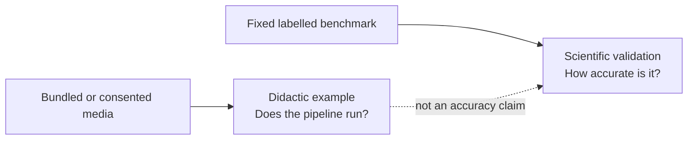

# Face Detection & Tracking Validation

A runnable example and a scientific validation answer different questions. The
bundled synthetic media demonstrates that the pipeline runs and makes qualitative
errors visible. A validation requires fixed annotated data, a declared split and
protocol, reproducible thresholds, and metrics computed against ground truth.



## Recommended datasets

Always review the current licence and access terms at the official source before
downloading, using, or redistributing a dataset.

| Dataset | Appropriate PhysioTrack use | Important distinction |
| --- | --- | --- |
| [WIDER FACE](https://shuoyang1213.me/WIDERFACE/) | primary face-box precision/recall and AP on the official easy, medium and hard validation subsets | face boxes; keep the official split and evaluation protocol |
| [FDDB](https://vis-www.cs.umass.edu/fddb/) | secondary unconstrained face-detection check | annotations are ellipses, so document the official rectangle conversion/evaluation protocol |
| [ChokePoint](https://arma.sourceforge.net/chokepoint/) | qualitative face detection/tracking across surveillance video sequences | most sequences show one subject at a time; its published baseline protocol is for verification, so define a separate tracking protocol and retain its non-commercial terms/citation |
| [Head Tracking 21 / CroHD](https://motchallenge.net/data/Head_Tracking_21/) | severe multi-object **head** tracking stress test | head boxes are not facial-region boxes; turned-away heads can legitimately be missed by a face detector |
| [CrowdHuman](https://www.crowdhuman.org/) | crowded person/head detection with `Detection.Person` | head and person annotations are not face annotations |
| [COCO](https://cocodataset.org/#download) | standard person detection using the person category | COCO has no face-box annotations |

Face, head, and person boxes use different annotation definitions. Do not score one
as another or compare their metrics without stating the conversion and its limits.

## Suggested progression

| Scene or question | First qualitative input | Later scientific input |
| --- | --- | --- |
| large/selfie faces | bundled synthetic selfie or consented local photo | WIDER FACE easy/medium subsets |
| many small faces | bundled crowd scene | WIDER FACE hard/crowd events |
| moving faces and ID stability | bundled synthetic clip or a short consented recording | ChokePoint with a separately documented tracking protocol, or another annotated face-tracking benchmark |
| many visible heads | a consented room recording | HT21/CroHD, explicitly labelled as head tracking |
| person rather than face detection | a consented group scene | COCO person or CrowdHuman person annotations |

## Recording local demonstration media

For a short local face-tracking demonstration, obtain informed consent and avoid
unrelated bystanders. Record 10–20 seconds at a known resolution and frame rate,
begin with visible frontal faces, include one crossing or brief occlusion, and record
lighting, distance, consent status, and exclusions in a manifest. Keep identifiable
research media outside the Git repository unless its redistribution is explicitly
authorized.

## Reproducibility manifest

Store at least the following beside every validation result:

```yaml
dataset: WIDER_FACE
version_or_download_date: YYYY-MM-DD
official_url: https://shuoyang1213.me/WIDERFACE/
license_checked: true
local_root: /external/data/path
split: validation
sample_selection: all
excluded_samples: []
ground_truth_format: xyxy_face_boxes
prediction_model: yolov11m-face.pt
physiotrack_commit: <git-sha>
confidence_threshold: 0.25
nms_iou_threshold: 0.45
device: cuda
```

For tracking, also record the tracker backend and all non-default association,
age/buffer, and initialization thresholds. Temporary IDs should be evaluated with a
declared multi-object tracking metric—not visually relabelled after the run.

## Reporting checklist

- State whether the input is a demonstration sample or a labelled benchmark.
- Name the model weights, PhysioTrack commit, device, software versions and image
  size.
- Record confidence/NMS thresholds and any excluded samples.
- Use the benchmark's official split and protocol where one exists.
- Report uncertainty or variation where appropriate; do not infer demographic
  fairness from a few curated scenes.
- Keep face detection, head detection, person detection, tracking, and recognition
  claims separate. PhysioTrack's face-tracking example performs no recognition.

## Results of the project validation

The face-analysis components were validated in a master's thesis on public benchmarks
with the protocol and manifest described above. The library's defaults are the settings
those evaluations used. The numbers describe that validation run; re-run the protocol
on your own data before relying on them.

| Component | Benchmark and protocol | Result |
| --- | --- | --- |
| Face detection (`Face`, `m_face`) | WIDER FACE validation, official easy / medium / hard | AP 0.959 / 0.949 / 0.872 |
| Head orientation (`FaceOrientation`, 1.2x square crop) | AFLW, ground-truth face boxes, \|angles\| < 90° | overall MAE 12.9° (yaw 11.1°, pitch 13.7°, roll 13.8°) |
| Face mesh (`FaceLandmarks`, 20 %-padded boxes) | 300-W, 51-point inter-ocular NME | NME 4.65 %, 98 % detected |
| Blinks (`detect_blinks`, EAR 0.22, 3 frames) | MPEBlink test split, event temporal IoU ≥ 0.5 | precision 0.32, recall 0.26, F1 0.29; mean duration error 0.10 s |
| Mouth openness (`mouth_aspect_ratio`) | FELT reference for RAVDESS speech clips | Pearson r 0.93, MAE 0.033 |
| Mouth movement (`mouth_movement`) | FELT / RAVDESS speech, paired frames | Pearson r 0.83, MAE 0.012 per frame |
| Gaze (`GazeEstimator`, ETH-XGaze) | MPIIFaceGaze, all 37,667 samples | mean angular error 8.2° (median 7.7°) |
| Face regions (`FaceRegions` / SegFace) | CelebAMask-HQ | pixel accuracy 0.956, mIoU 0.815 |
| Face tracking (`Face` + OC-SORT) | ECCV 2016 face tracking videos | recall 91 %, precision 72 %, MOTA 53 % |

The blink results show the limits of a fixed EAR threshold on unconstrained video:
treat blink counts from non-frontal or low-resolution faces as indicative only.

